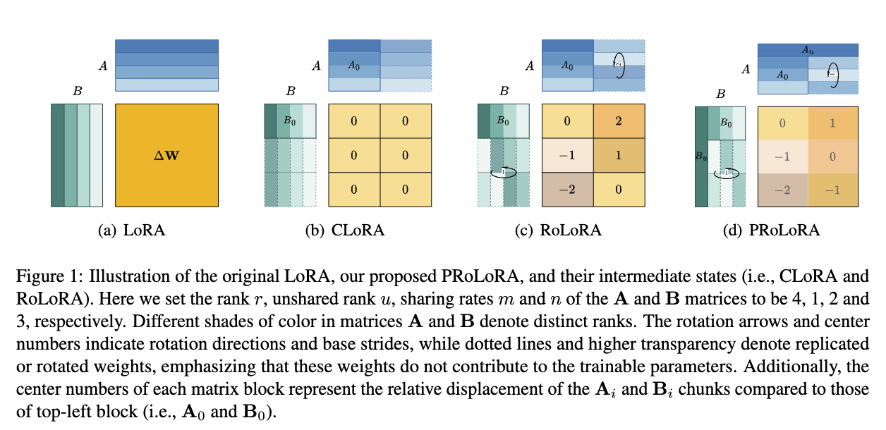

<h1 align="center">
<!--  -->
<br>
PRoLoRA: Partial Rotation Empowers More Parameter-Efficient LoRA
</h1>


<p align="center">
  <a href="https://arxiv.org/abs/2402.16902"><b>[📄 Paper]</b></a> •
  <a href="https://hub.docker.com/r/forence/open-instruct"><b>[🐳 Docker]</b></a> •
  <a href="https://github.com/Forence1999/PRoLoRA"><b>[🗁 GitHub]</b></a>
</p>

<p align="center">
🔥 Official repo for "<a href="https://arxiv.org/abs/2402.16902" target="_blank">PRoLoRA: Partial Rotation Empowers More Parameter-Efficient LoRA</a>".
</p>
<p align="center">
❗️ Most of files are inherited from AllenAI's great <a href="https://github.com/allenai/open-instruct" target="_blank">work</a>. We show our greatest respect to their efforts, and all the relevant rights are reserved for the ORIGINAL authors!
</p>

<p align="center">
  
</p>


## 🔥 News
- [2024/05/16] 🔥🔥🔥 ProLoRA is accepted by ACL 2024 (main conference)!


## 💡 Abstract
With the rapid scaling of large language models (LLMs), serving numerous LoRAs concurrently has become increasingly impractical, leading to unaffordable costs and necessitating more parameter-efficient finetuning methods. In this work, we introduce Partially Rotationenhanced Low-Rank Adaptation (PRoLoRA), an intra-layer sharing mechanism comprising four essential components: broadcast reduction, rotation enhancement, partially-sharing refinement, and rectified initialization strategy. As a superset of LoRA, PRoLoRA pertains its advantages, and effectively circumvent the drawbacks of peer parameter-sharing methods with superior model capacity, practical feasibility, and broad applicability. Empirical experiments demonstrate the remarkably higher parameter efficiency of PRoLoRA in both specific parameter budget and performance target scenarios, and its scalability to larger LLMs. Notably, with one time less trainable parameters, PRoLoRA still outperforms LoRA on multiple instruction tuning datasets. Subsequently, an ablation study is conducted to validate the necessity of individual components and highlight the superiority of PRoLoRA over three potential variants. Hopefully, the conspicuously higher parameter efficiency can establish PRoLoRA as a resource-friendly alternative to LoRA.

<!-- ## 🚀 -->

## ⚙️ Environment setting

### 🗁 Prepare GitHub Repo
```bash
# Clone the repo to local machine
git clone https://github.com/Forence1999/open-instruct-1121.git
cd open-instruct-1121
```


### 🐳 Docker

We recommend to setup the environment with our docker [image](https://hub.docker.com/r/forence/open-instruct), which will prepare the whole environment and ease your reproduction with minimal effort.

```bash
# Pull the image from dockerhub
docker pull forence/open-instruct:v1

# Start the container, remember to replace <PROJECT_DIR> with your own project directory
docker run \
    --name prolora \
    --gpus all \
    --network=host \
    -v <PROJECT_DIR>:/workspace \
    -it forence/open-instruct:v1 /bin/bash

cd /workspace
```

### 🐍 Conda
If you use the above docker image, this step can be skipped, because the conda env has been well prepared in it.
```bash
# Create and activate conda environment
conda create -n prolora python=3.11
conda activate prolora

# Install required dependencies
pip install -r requirements.txt
```

## 📜 Datasets
The data preparation is inherited from the paper ["How Far Can Camels Go? Exploring the State of Instruction Tuning on Open Resources"](https://arxiv.org/abs/2306.04751) and  [open-instruct](https://github.com/allenai/open-instruct.git) github repo, which can be refered for deatiled information. For simplicity, you can download and process the datasets for both fine-tuning and evaluation with following scripts:

```bash
# Prepare the training data
./scripts/prepare_train_data.sh

# Prepare the evaluation data
./scripts/prepare_eval_data.sh
```

<!-- Benchmark for evaluation includes:
- [MMLU](https://github.com/hendrycks/test)
- [Grade School Math (GSM)](https://github.com/openai/grade-school-math)
- [Big-Bench Hard (BBH)](https://github.com/suzgunmirac/BIG-Bench-Hard/tree/main)
- [TydiQA](https://github.com/google-research-datasets/tydiqa)
- [Codex HumanEval](https://github.com/openai/human-eval/tree/master) -->


## 📃 Experiments

LLaMA series require addtional requests to download. For LLaMA2 models, please refer to [Hugging Face documentation for LLaMA](https://huggingface.co/docs/transformers/model_doc/llama2) for requesting the access token.

There are two alternative methods to pass the access token:
1. Pass as a parameter (Recommended)
  ```bash
  # Set the <HF_TOKEN> in the shell script and pass it as:
  --token ${HF_TOKEN}
  ```
2. Pass through environment variable
  ```bash
  python -c "from huggingface_hub.hf_api import HfFolder; HfFolder.save_token(<HF_TOKEN>)"
  ```

All the preparation work is done! Here's an example to fine-tune LLaMA2-7B with SuperNI and evaluation on MMLU. The running script is as follows:

```bash
# Before running the following script, please replace the <HF_TOKEN> with your own huggingface token
bash ft_llama2_7b_superni_mmlu.sh <LORA_RANK> <UNSHARED_RANK> <REDUCED_LORA_A_X> <REDUCED_LORA_B_X> <LEARNING_RATE> <SEED> <GPU_ID>
```

Here's a detailed description for each parameter:
- `LORA_RANK`: The rank of PRoLoRA, refered as the variable `r` in our paper.
- `UNSHARED_RANK`: Among all the ranks `r` in PRoLoRA, how many ranks are preserved to be unshared, refered as the variable `u` in our paper.
- `REDUCED_LORA_A_X / REDUCED_LORA_B_X`: Multiples of PRoLoRA matrices A / B sharing, refered as the variables `m` / `n` in our paper, respectively.
- `LEARNING_RATE`: Linear learning rate.
- `SEED`: Random seed.
- `GPU_ID`: The id of GPU assigned for the run.

We also provide commands to postprocess and summarize the results, the running script is as follows:

```python
# For MMLU
python mmlu_summarize.py --ts <TIME_SPAN>

# For TydiQA
python mmlu_summarize.py --ts <TIME_SPAN>
```
- `TIME_SPAN`: Duration of the present time from its last modification time in hours to be considered in result summary.


## © Citation

If you find our wrok helpful, please kindly cite the paper as follows:
```
@article{wang2024prolora,
      title={PRoLoRA: Partial Rotation Empowers More Parameter-Efficient LoRA}, 
      author={Sheng Wang and Boyang Xue and Jiacheng Ye and Jiyue Jiang and Liheng Chen and Lingpeng Kong and Chuan Wu},
      year={2024},
      eprint={2402.16902},
      archivePrefix={arXiv},
      primaryClass={cs.LG},
      url={https://arxiv.org/abs/2402.16902}, 
}
```